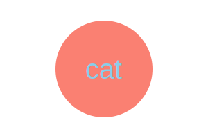

# Logo Creator

## Description

This Node command line tool allows a user to create a logo and customize it: text (up to 3 chars long); color for the text; shape (circle, triangle, square); and shape color. The tool prompts the user for input and generates a logo.svg file based on the user's answers. This tool was built using inquirer to prompt user input and also with object oriented principles. Specifically, the principle of inheritance was used to create a Shape parent class that the children classes of Circle, Triangle, and Square inherited from. Finally, some unit testing was done using Jest to test each of these classes.

Another thing that I emphasized is input validation. It's good practice to verify user input and ensure that they are entering values that are expected and won't crash the application. Specifically for object color, I only allowed the user to input an allowed svg color keyword or a hex color code using regex matching. If they type anything else, then inquirer won't let them proceed to the next question.

## Table of Contents

- [Description](#description)
- [Installation](#installation)
- [Usage](#usage)
- [Contributing](#contributing)
- [Tests](#tests)
- [License](#license)
- [Questions](#questions)

## Installation

To install and use this app, clone this repo and navigate to the root directory. Run `npm i` to install the necessary libraries used to run this app e.g. inquirer, jest. These libraries are specified in the package.json.

## Usage

To run this app, navigate to the project root. Run `node index.js` in Terminal, and you will be prompted with a series of questions to generate your logo.

To see a walkthrough video of this, please view this Google Drive link: https://drive.google.com/file/d/17sbJaw1l8p3vEHJ6Z4io_7dVCOE1ZZJU/view?usp=sharing

Here are some example of SVG logos created with this app:

## Contributing

To contribute, please clone or fork this repo and make a pull request for my review.

## Tests

There are unit tests specified in the lib/shapes.test.js file. To run these tests, run `npm test`.

## License

This application uses the MIT license. Please see
https://mit-license.org/ for more information on this license.

## Questions

You can find me [HERE](https://github.com/mslzbry) on Github.
Feel free to email me at m.slzbry@gmail.com if you have any additional questions.
